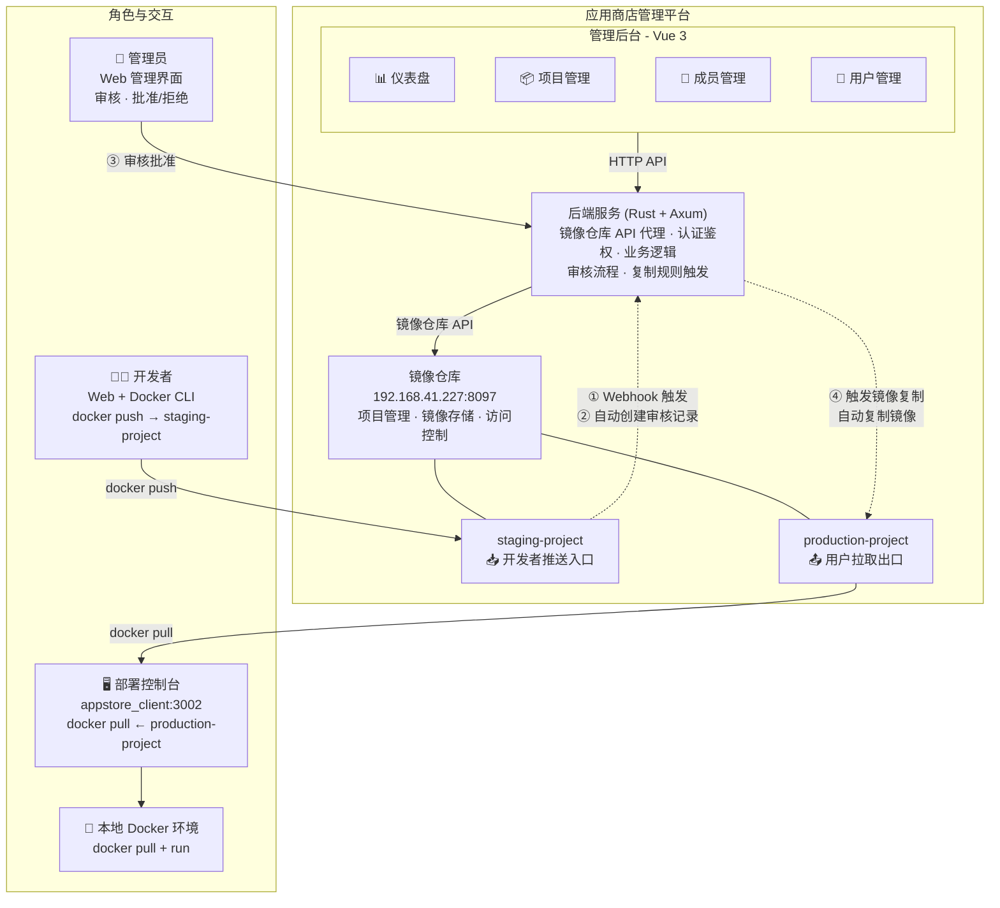
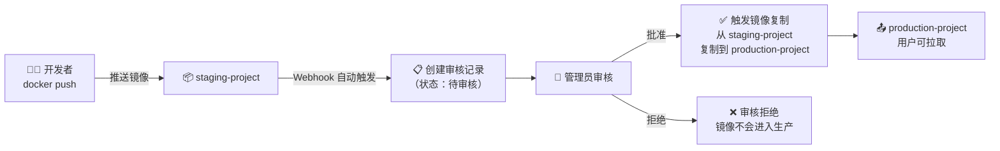
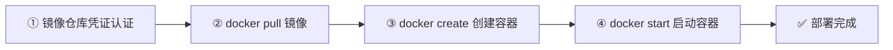
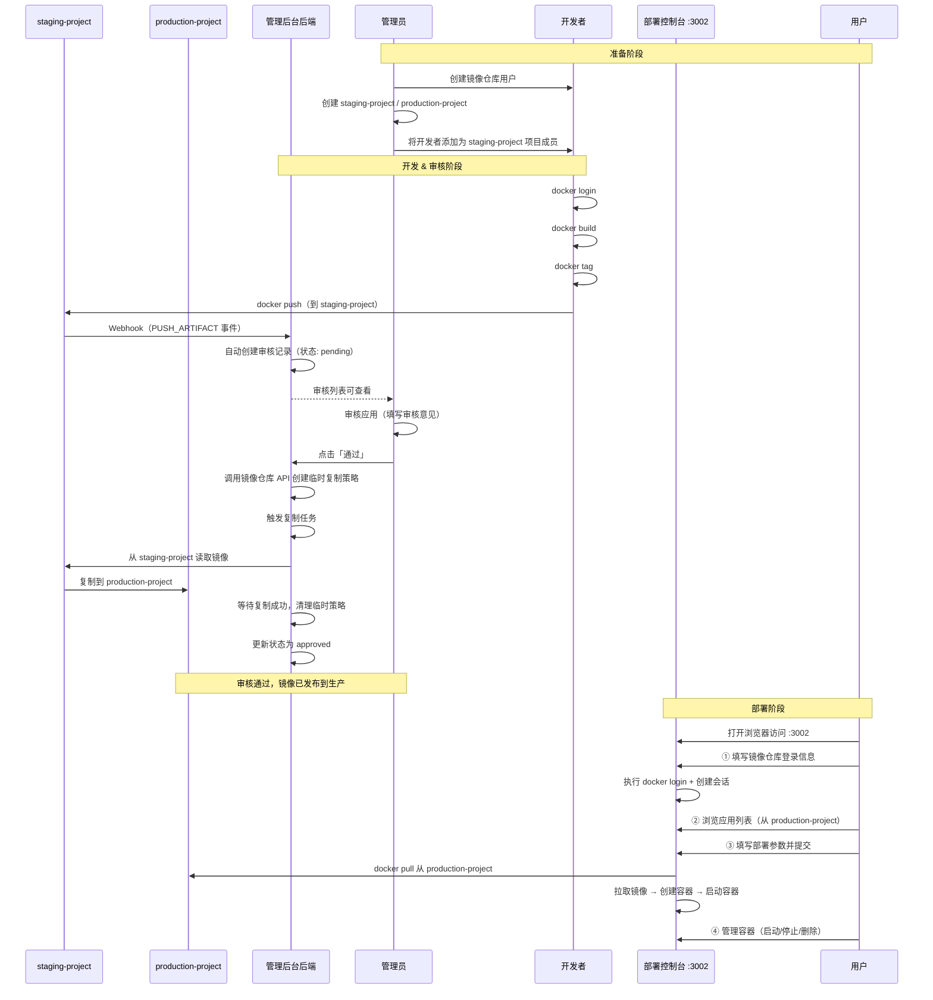

# 应用商店平台使用手册

## 概述

应用商店平台是一个 **镜像管理系统**，提供应用镜像的存储、管理和一键部署能力。

### 平台组件

| 组件 | 说明 | 访问方式 |
|------|------|---------|
| **管理后台** | 管理员管理项目、成员、用户 | Web 浏览器 |
| **镜像仓库** | 容器镜像存储 | `192.168.41.227:8097` |
| **部署控制台** | 用户登录拉取镜像并管理容器 | `http://<host>:3002` |

### 角色职责

| 角色 | 职责 | 使用什么 |
|------|------|---------|
| **开发者** | 构建 Docker 镜像并发布到商店 | 管理后台查看推送命令 + Docker CLI |
| **管理员** | 管理平台项目、成员、用户 | 管理后台 Web 界面 |
| **用户** | 浏览商店应用、一键部署容器 | **部署控制台** (appstore_client) |

---

## 系统架构



---

## 镜像命名规则

```
192.168.41.227:8097/<项目名称>/<应用名称>:<版本号>
```

### 项目环境

| 项目 | 用途 | 推送权限 | 拉取权限 |
|------|------|---------|---------|
| **staging-project** (预发布) | 开发者推送镜像，触发审核 | 开发者 | 管理员 |
| **production-project** (生产) | 审核通过后自动复制，用户拉取部署 | 仅通过复制规则 | 所有用户 |

示例：
- `192.168.41.227:8097/staging-project/happy_chat:V1.0.0`（开发者推送）
- `192.168.41.227:8097/production-project/happy_chat:V1.0.0`（审核通过后自动同步）

---

## 一、开发者工作流程

开发者负责将构建好的 Docker 镜像发布到应用商店的 **staging-project**（预发布项目），触发审核流程，审核通过后自动同步到 **production-project**（生产项目）供用户拉取。

### 前置条件

- 已安装 Docker
- 已获得镜像仓库的登录凭证
- 已被管理员添加到对应项目的 **开发者（Developer）** 角色

### 1.1 查看推送命令

管理后台提供了推送命令查询功能：

1. 进入 **应用管理 → 项目管理**
2. 点击项目名称进入 **应用仓库**
3. 在目标仓库行点击 **推送命令** 按钮（上传图标）
4. 弹窗显示操作步骤和命令，支持一键复制

### 1.2 登录 → 打标签 → 推送

```bash
# 1. 登录
docker login 192.168.41.227:8097

# 2. 构建（或从已有镜像打标签）
docker build -t happy_chat:latest .
# 或: docker tag <已有镜像> happy_chat:latest

# 3. 打标签（推送到 staging-project，触发审核）
docker tag happy_chat:latest 192.168.41.227:8097/staging-project/happy_chat:V1.0.0

# 4. 推送
docker push 192.168.41.227:8097/staging-project/happy_chat:V1.0.0
```

---

## 二、管理员工作流程

管理员通过 Web 管理后台进行全面管理。

### 2.1 首页仪表盘

| 卡片 | 说明 |
|------|------|
| **总应用数** | 平台项目总数 |
| **总镜像数** | 所有 Artifact 总数 |
| **总拉取量** | 所有镜像累计拉取次数 |
| **活跃项目** | 当前项目总数 |

下方还有热门下载 TOP 5、最新上架、项目分布等。

### 2.2 项目管理

进入 **应用管理 → 项目管理** 的 **项目概要** 标签页。

- **创建项目**：填写项目名称，选择公开/私有
- **查看仓库**：点击项目名称查看其下的所有应用仓库
- **查看 Artifact**：点击仓库名称查看版本列表（Tags、大小、Digest）
- **拉取命令**：每个 Artifact 提供 Docker/Podman/nerdctl/ctr/crictl 五种拉取命令
- **删除项目**：在操作列删除

### 2.3 成员管理

进入 **项目成员** 标签页，将用户添加到项目并分配角色：

| 角色 | 值 | 权限 |
|------|----|------|
| 项目管理员 | 1 | 管理项目设置、成员、推送/拉取镜像 |
| 开发者 | 2 | 推送/拉取镜像 |
| 访客 | 3 | 只读，可拉取镜像 |
| 维护者 | 4 | 维护权限 |

### 2.4 用户管理

在 **系统管理 → 用户管理** 中创建用户，用于 Docker 登录和部署控制台登录。

### 2.5 应用审核

应用商店采用 **预发布（staging）→ 审核 → 生产（production）** 的发布流程。开发者推送镜像到 staging-project 后，需要管理员审核通过，镜像才能自动同步到 production-project 供用户拉取。

#### 审核流程概述



#### 2.5.1 审核记录自动创建

当开发者推送镜像到 **staging-project** 时，镜像仓库会自动发送 Webhook 通知后端服务，后端自动创建一条审核记录：

- **触发条件**：任意新镜像推送到 `staging-project` 下的仓库
- **自动填充字段**：源项目（staging-project）、目标项目（production-project）、仓库名称、Tag、Digest
- **初始状态**：`pending`（待审核）
- **去重机制**：同一仓库 + 同一 Tag 的待审核记录只会创建一条，重复推送不会重复创建

> **前置条件**：需要为 staging-project 配置 Webhook，指向 `http://<后端地址>:3000/api/webhooks/harbor`，并配置 `webhook_secret`。

#### 2.5.2 手动创建审核记录

管理员也可以在 **应用管理 → 项目管理 → 应用仓库 → Artifact 详情** 中点击 **审核** 按钮，手动发起审核：

1. 进入 **应用管理 → 项目管理**
2. 点击项目名称进入 **应用仓库**
3. 点击仓库名称查看 **Artifact 列表**
4. 在目标 Artifact 行点击 **审核** 按钮
5. 弹窗中自动填充：源项目、目标项目、仓库名称、Tag、Digest
6. （可选）填写备注后提交，创建审核记录

#### 2.5.3 审核列表

在 **应用管理** 页面，点击 **应用审核** 标签页，以表格形式展示所有审核记录：

| 字段 | 说明 |
|------|------|
| **源项目** | 镜像来源项目（staging-project） |
| **目标项目** | 镜像目标项目（production-project） |
| **仓库** | 应用名称 |
| **Tag** | 版本号 |
| **摘要** | 镜像 Digest |
| **状态** | 待审核 / 已通过 / 已拒绝 |
| **审核意见** | 管理员填写的审核意见 |
| **创建时间** | 审核记录的创建时间 |

**筛选功能**：
- 按 **仓库名称** 模糊搜索
- 按 **状态** 筛选（全部 / 待审核 / 已通过 / 已拒绝）

#### 2.5.4 审核操作

对状态为 **待审核** 的记录，管理员可执行以下操作：

**通过审核**：
1. 点击 **通过** 按钮
2. （可选）在弹出的对话框中填写审核意见
3. 确认后系统自动执行：
   - 调用镜像仓库 API 创建临时复制规则
   - 自动触发复制任务，将镜像从 `staging-project` 复制到 `production-project`
   - 等待复制任务完成（默认超时 30 秒）
   - 清理临时复制规则
   - 将审核状态更新为 `approved`
4. 提示"审核通过并已触发复制"

> **技术原理**：后端通过镜像仓库 REST API 动态创建一个临时的 Replication Policy，设置源为 `staging-project`，目标为 `production-project`，按仓库名称和 Tag 过滤，触发手动执行，等待执行成功（Succeed）后自动删除该策略。这确保了只有审核通过的镜像才会进入生产环境。

**拒绝审核**：
1. 点击 **拒绝** 按钮
2. （可选）在弹出的对话框中填写拒绝理由
3. 确认后状态更新为 `rejected`
4. 镜像不会同步到 production-project

**删除审核记录**：支持删除已完成的审核记录（软删除）。

---

## 三、用户工作流程（部署控制台）

用户通过 **部署控制台** (`appstore_client`) 浏览应用商店、拉取镜像并管理容器。

> 部署控制台是一个独立的 Web 应用，运行在 `http://<host>:3002`。

### 3.1 登录部署控制台

打开浏览器访问：

```
http://<部署控制台地址>:3002
```

填写登录表单：

| 字段 | 说明 | 示例 |
|------|------|------|
| **应用商店地址** | 镜像仓库地址 | `http://192.168.41.227:8097` |
| **用户名** | 镜像仓库用户名 | `zhangzexin` |
| **密码** | 镜像仓库密码 | `********` |

点击「执行 docker login」，后端自动执行 `docker login` 并创建会话。

### 3.2 浏览应用列表

登录后 **应用列表** 区域展示所有可用的应用镜像（从镜像仓库获取）：

| 内容 | 说明 |
|------|------|
| **镜像名称** | `项目名/应用名` |
| **标签** | 该应用的版本号（Tags），最多显示 5 个 |
| **版本数** | 总 Artifact 数量 |
| **部署按钮** | 点击进入部署对话框 |

### 3.3 一键部署应用

点击「部署」按钮，弹出部署对话框：

| 字段 | 说明 | 示例 |
|------|------|------|
| **镜像** | 自动填充，不可修改 | `appstore/happy_chat:V1.0.0` |
| **容器名称** | 自定义容器名 | `my-happy-chat` |
| **端口映射** | 逗号分隔，`宿主机端口:容器端口` | `8080:80,3306:3306` |
| **环境变量** | 每行一个，`KEY=value` | `MODE=production` |

点击「拉取并启动容器」，后端自动完成：



### 3.4 容器管理

部署后 **容器列表** 展示宿主机上所有容器，支持分页：

| 操作 | 说明 |
|------|------|
| **启动** | 启动已停止的容器（轮询确认状态） |
| **停止** | 停止运行中的容器（5 秒超时） |
| **删除** | 强制删除容器（`docker rm -f`） |

列表展示：容器名称、镜像、状态（运行中/已退出/暂停）、运行信息。

### 3.5 完整使用示例

```
1. 打开 http://部署控制台:3002
2. 填写镜像仓库地址/用户名/密码，点击登录
3. 在应用列表中找到 appstore/happy_chat
4. 点击「部署」
5. 填写：
   容器名称: my-happy-chat
   端口映射: 3000:3000
   环境变量: TZ=Asia/Shanghai
6. 点击「拉取并启动容器」
7. 等待部署完成，在容器列表中看到运行中的容器
8. 可通过「停止」「启动」「删除」按钮管理容器
```

---

## 四、角色协作流程



---

## 五、部署控制台技术细节

### 架构


### 启动方式

```bash
cd ~/IdeaProjects/appstore_client

# 默认端口 3002
cargo run

# 指定端口
PORT=8080 cargo run

# 镜像仓库使用自签证书时开启不安全模式
HARBOR_INSECURE=true cargo run
```

### API 一览

#### 部署控制台 API（端口 3002）

| 方法 | 路径 | 说明 |
|------|------|------|
| `GET` | `/` | 返回前端页面 |
| `POST` | `/api/login` | 登录（执行 `docker login` + 创建会话） |
| `GET` | `/api/images` | 从镜像仓库获取所有镜像列表（从 production-project） |
| `GET` | `/api/containers` | 列出本地 Docker 容器（支持 page/per_page） |
| `GET` | `/api/containers/:name/status` | 查询容器运行状态 |
| `POST` | `/api/containers/:name/start` | 启动容器 |
| `POST` | `/api/containers/:name/stop` | 停止容器 |
| `DELETE` | `/api/containers/:name` | 删除容器 |
| `POST` | `/api/deploy` | 拉取镜像并创建/启动容器 |

#### 管理后台审核 API（端口 3000）

| 方法 | 路径 | 说明 |
|------|------|------|
| `POST` | `/api/appReviews` | 创建审核记录 |
| `GET` | `/api/appReviews` | 分页查询审核列表（支持按状态、仓库名称筛选） |
| `GET` | `/api/appReviews/{id}` | 获取审核详情 |
| `POST` | `/api/appReviews/{id}/approve` | 通过审核（触发镜像复制） |
| `POST` | `/api/appReviews/{id}/reject` | 拒绝审核 |
| `DELETE` | `/api/appReviews/{id}` | 删除审核记录 |
| `POST` | `/api/webhooks/harbor` | Webhook 接收端点（接收 PUSH_ARTIFACT 事件） |

---

## 六、最佳实践

### 版本号规范

推荐语义化版本号：`V1.0.0`、`V1.0.0-beta`、`V1.0.0-rc.1`

### 审核与复制配置

- 确保为 **staging-project** 配置 Webhook，地址为 `http://<管理后台地址>:3000/api/webhooks/harbor`，事件类型选择 **Push Artifact**
- 配置 `backend/config/config.toml` 中的 `[harbor]` 段：
  - `staging_project` — 预发布项目名称（默认 `staging-project`）
  - `production_project` — 生产项目名称（默认 `production-project`）
  - `webhook_secret` — Webhook 密钥，用于验证请求来源
  - `replication_timeout_secs` — 等待复制完成超时时间（默认 30 秒）
- 确保镜像仓库中有 **本地 Registry 端点**，复制规则需要引用本地端点进行项目间复制
- 生产项目建议设为 **公开**，方便普通用户拉取镜像（无需登录）

### 安全建议

- 开发者凭证应定期更换
- 私有项目注意访问控制
- Docker 登录凭证不要提交到代码仓库
- 使用 `.dockerignore` 避免敏感文件进入镜像
- 配置 `webhook_secret` 防止 Webhook 端点被恶意调用

### 部署控制台运维

- 确保部署控制台所在机器安装了 Docker
- 确保 `DOCKER_HOST` 环境变量正确指向 Docker 守护进程
- 生产环境建议关闭 CORS permissive，配置反向代理