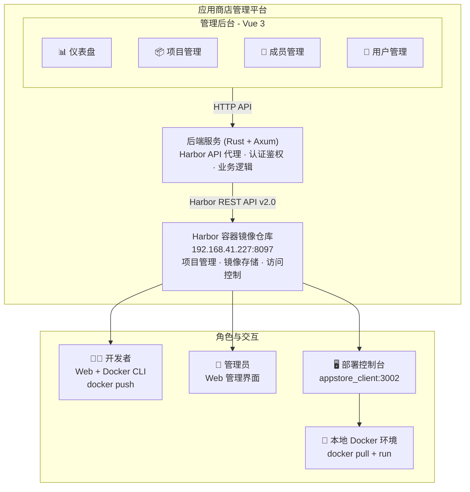
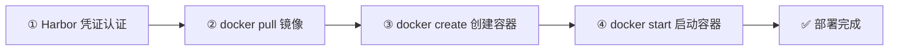
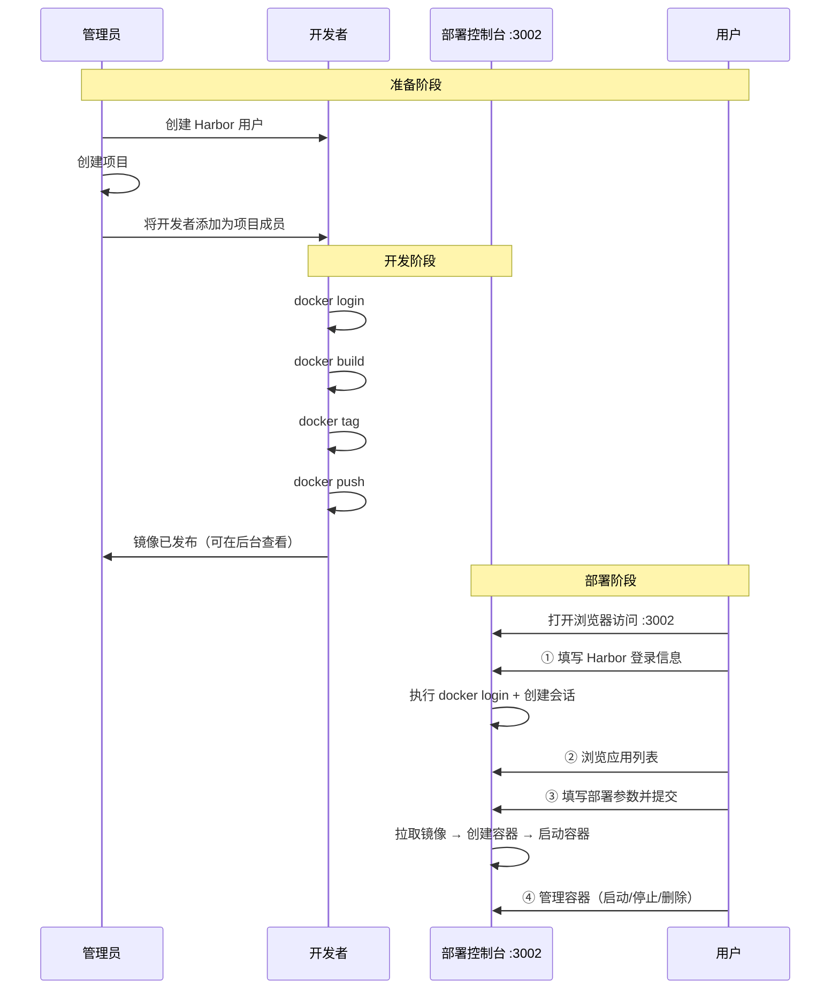
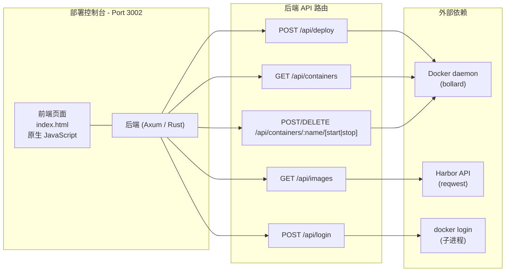

# 应用商店平台使用手册

## 概述

应用商店平台是一个基于 **Harbor** 的容器镜像管理系统，提供应用镜像的存储、管理和一键部署能力。

### 平台组件

| 组件 | 说明 | 访问方式 |
|------|------|---------|
| **管理后台** | 管理员管理项目、成员、用户 | Web 浏览器 |
| **Harbor 仓库** | 容器镜像存储 | `192.168.41.227:8097` |
| **部署控制台** | 用户登录拉取镜像并管理容器 | `http://<host>:3002` |

### 角色职责

| 角色 | 职责 | 使用什么 |
|------|------|---------|
| **开发者** | 构建 Docker 镜像并发布到商店 | 管理后台查看推送命令 + Docker CLI |
| **管理员** | 管理平台项目、成员、用户 | 管理后台 Web 界面 |
| **用户** | 浏览商店应用、一键部署容器 | **部署控制台** (appstore_client) |

---

## 系统架构



---

## 镜像命名规则

```
192.168.41.227:8097/<项目名称>/<应用名称>:<版本号>
```

示例：
- `192.168.41.227:8097/appstore/happy_chat:V1.0.0`
- `192.168.41.227:8097/appstore/redis:V2.1.0`

---

## 一、开发者工作流程

开发者负责将构建好的 Docker 镜像发布到应用商店。

### 前置条件

- 已安装 Docker
- 已获得 Harbor 镜像仓库的登录凭证
- 已被管理员添加到对应项目的 **开发者（Developer）** 角色

### 1.1 查看推送命令

管理后台提供了推送命令查询功能：

1. 进入 **应用管理 → 项目管理**
2. 点击项目名称进入 **应用仓库**
3. 在目标仓库行点击 **推送命令** 按钮（上传图标）
4. 弹窗显示操作步骤和命令，支持一键复制

### 1.2 登录 → 打标签 → 推送

```bash
# 1. 登录
docker login 192.168.41.227:8097

# 2. 构建（或从已有镜像打标签）
docker build -t happy_chat:latest .
# 或: docker tag <已有镜像> happy_chat:latest

# 3. 打标签
docker tag happy_chat:latest 192.168.41.227:8097/appstore/happy_chat:V1.0.0

# 4. 推送
docker push 192.168.41.227:8097/appstore/happy_chat:V1.0.0
```

---

## 二、管理员工作流程

管理员通过 Web 管理后台进行全面管理。

### 2.1 首页仪表盘

| 卡片 | 说明 |
|------|------|
| **总应用数** | 平台项目总数 |
| **总镜像数** | 所有 Artifact 总数 |
| **总拉取量** | 所有镜像累计拉取次数 |
| **活跃项目** | 当前项目总数 |

下方还有热门下载 TOP 5、最新上架、项目分布等。

### 2.2 项目管理

进入 **应用管理 → 项目管理** 的 **项目概要** 标签页。

- **创建项目**：填写项目名称，选择公开/私有
- **查看仓库**：点击项目名称查看其下的所有应用仓库
- **查看 Artifact**：点击仓库名称查看版本列表（Tags、大小、Digest）
- **拉取命令**：每个 Artifact 提供 Docker/Podman/nerdctl/ctr/crictl 五种拉取命令
- **删除项目**：在操作列删除

### 2.3 成员管理

进入 **项目成员** 标签页，将用户添加到项目并分配角色：

| 角色 | 值 | 权限 |
|------|----|------|
| 项目管理员 | 1 | 管理项目设置、成员、推送/拉取镜像 |
| 开发者 | 2 | 推送/拉取镜像 |
| 访客 | 3 | 只读，可拉取镜像 |
| 维护者 | 4 | 维护权限 |

### 2.4 用户管理

在 **系统管理 → 用户管理** 中创建用户，用于 Docker 登录和部署控制台登录。

---

## 三、用户工作流程（部署控制台）

用户通过 **部署控制台** (`appstore_client`) 浏览应用商店、拉取镜像并管理容器。

> 部署控制台是一个独立的 Web 应用，运行在 `http://<host>:3002`。

### 3.1 登录部署控制台

打开浏览器访问：

```
http://<部署控制台地址>:3002
```

填写登录表单：

| 字段 | 说明 | 示例 |
|------|------|------|
| **应用商店地址** | Harbor 仓库地址 | `http://192.168.41.227:8097` |
| **用户名** | Harbor 用户名 | `zhangzexin` |
| **密码** | Harbor 密码 | `********` |

点击「执行 docker login」，后端自动执行 `docker login` 并创建会话。

### 3.2 浏览应用列表

登录后 **应用列表** 区域展示所有可用的应用镜像（从 Harbor 获取）：

| 内容 | 说明 |
|------|------|
| **镜像名称** | `项目名/应用名` |
| **标签** | 该应用的版本号（Tags），最多显示 5 个 |
| **版本数** | 总 Artifact 数量 |
| **部署按钮** | 点击进入部署对话框 |

### 3.3 一键部署应用

点击「部署」按钮，弹出部署对话框：

| 字段 | 说明 | 示例 |
|------|------|------|
| **镜像** | 自动填充，不可修改 | `appstore/happy_chat:V1.0.0` |
| **容器名称** | 自定义容器名 | `my-happy-chat` |
| **端口映射** | 逗号分隔，`宿主机端口:容器端口` | `8080:80,3306:3306` |
| **环境变量** | 每行一个，`KEY=value` | `MODE=production` |

点击「拉取并启动容器」，后端自动完成：



### 3.4 容器管理

部署后 **容器列表** 展示宿主机上所有容器，支持分页：

| 操作 | 说明 |
|------|------|
| **启动** | 启动已停止的容器（轮询确认状态） |
| **停止** | 停止运行中的容器（5 秒超时） |
| **删除** | 强制删除容器（`docker rm -f`） |

列表展示：容器名称、镜像、状态（运行中/已退出/暂停）、运行信息。

### 3.5 完整使用示例

```
1. 打开 http://部署控制台:3002
2. 填写 Harbor 地址/用户名/密码，点击登录
3. 在应用列表中找到 appstore/happy_chat
4. 点击「部署」
5. 填写：
   容器名称: my-happy-chat
   端口映射: 3000:3000
   环境变量: TZ=Asia/Shanghai
6. 点击「拉取并启动容器」
7. 等待部署完成，在容器列表中看到运行中的容器
8. 可通过「停止」「启动」「删除」按钮管理容器
```

---

## 四、角色协作流程



---

## 五、部署控制台技术细节

### 架构



### 启动方式

```bash
cd ~/IdeaProjects/appstore_client

# 默认端口 3002
cargo run

# 指定端口
PORT=8080 cargo run

# Harbor 使用自签证书时开启不安全模式
HARBOR_INSECURE=true cargo run
```

### API 一览

| 方法 | 路径 | 说明 |
|------|------|------|
| `GET` | `/` | 返回前端页面 |
| `POST` | `/api/login` | 登录（执行 `docker login` + 创建会话） |
| `GET` | `/api/images` | 从 Harbor 获取所有镜像列表 |
| `GET` | `/api/containers` | 列出本地 Docker 容器（支持 page/per_page） |
| `GET` | `/api/containers/:name/status` | 查询容器运行状态 |
| `POST` | `/api/containers/:name/start` | 启动容器 |
| `POST` | `/api/containers/:name/stop` | 停止容器 |
| `DELETE` | `/api/containers/:name` | 删除容器 |
| `POST` | `/api/deploy` | 拉取镜像并创建/启动容器 |

---

## 六、最佳实践

### 版本号规范

推荐语义化版本号：`V1.0.0`、`V1.0.0-beta`、`V1.0.0-rc.1`

### 安全建议

- 开发者凭证应定期更换
- 私有项目注意访问控制
- Docker 登录凭证不要提交到代码仓库
- 使用 `.dockerignore` 避免敏感文件进入镜像

### 部署控制台运维

- 确保部署控制台所在机器安装了 Docker
- 确保 `DOCKER_HOST` 环境变量正确指向 Docker 守护进程
- 生产环境建议关闭 CORS permissive，配置反向代理

---

## 七、故障排查

### 部署控制台登录失败

```
Docker/Harbor 登录失败: ...
```

1. 确认 Harbor 地址、用户名、密码是否正确
2. 确认部署控制台机器能访问 Harbor 地址
3. 确认该用户已在 Harbor 中创建

### 推送被拒绝

```
denied: requested access to the resource is denied
```

**原因：** 用户没有项目推送权限。
**解决：** 联系管理员将该用户添加到项目的 **开发者** 或 **项目管理员** 角色。

### 部署失败

```
拉取镜像失败: ...
创建容器失败: ...
```

1. 检查镜像名称和标签是否正确
2. 检查磁盘空间是否充足
3. 检查端口映射是否被占用
4. 查看部署控制台后端日志

### 管理后台数据不显示

1. 检查 `backend/config/config.toml` 中 `[harbor]` 配置
2. 确认 Harbor 服务可从后端服务器访问
3. 查看后端日志：`RUST_LOG=debug cargo run`
